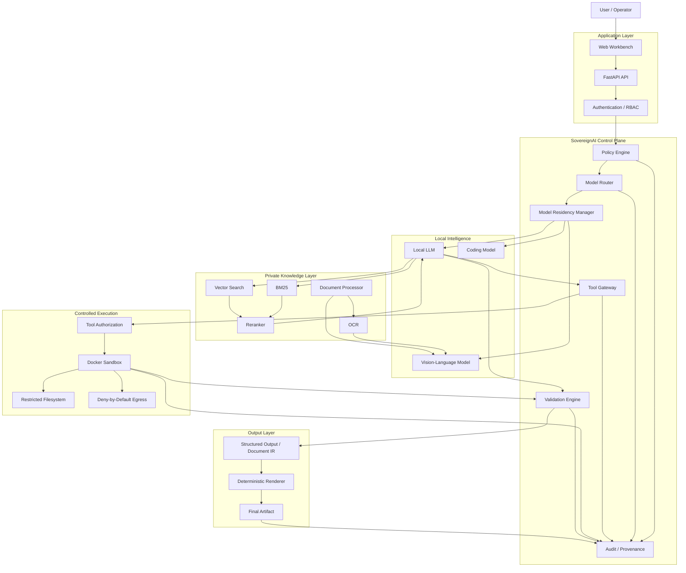
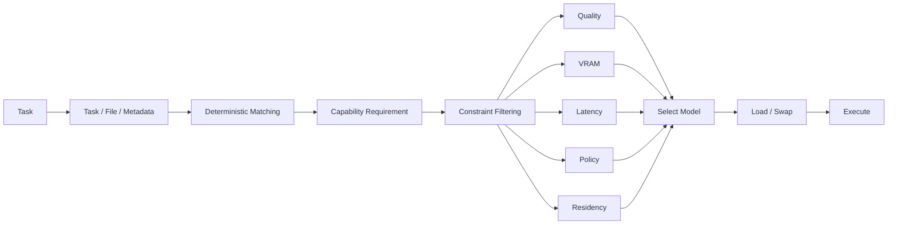
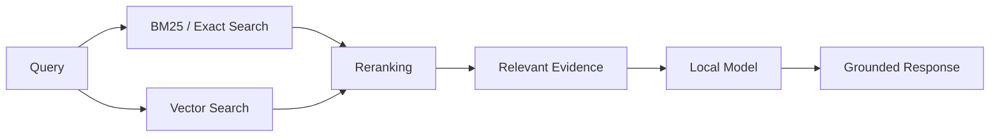
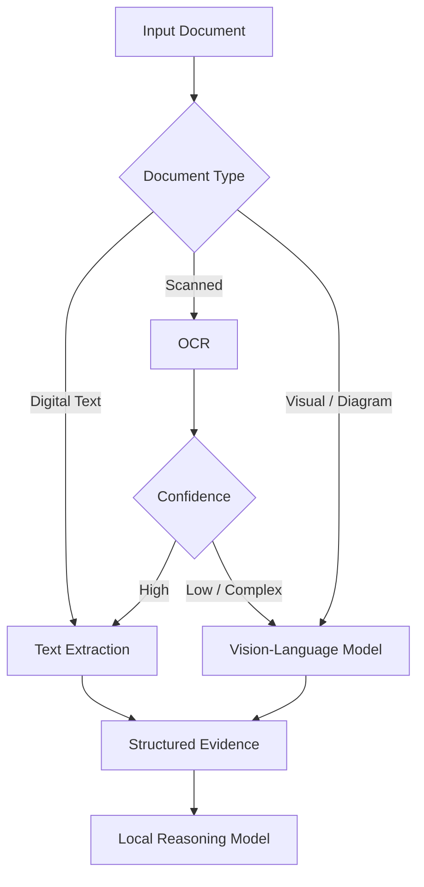
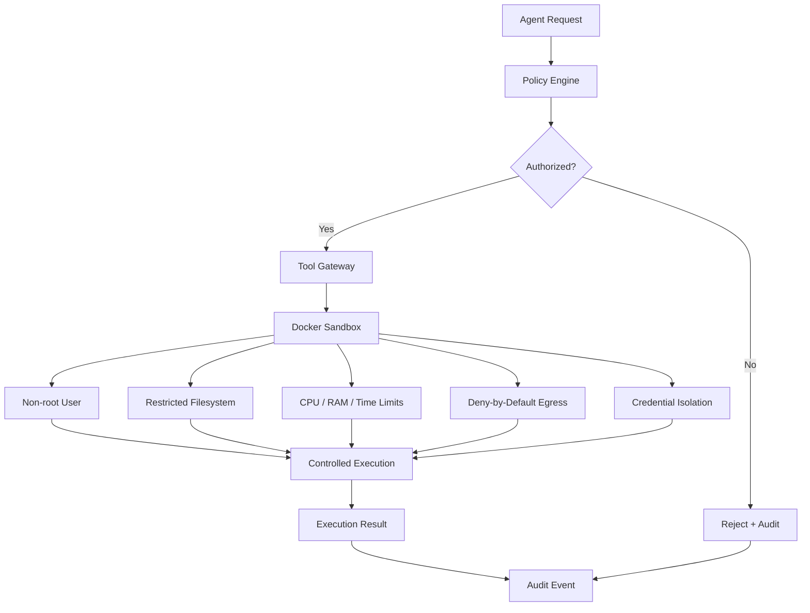
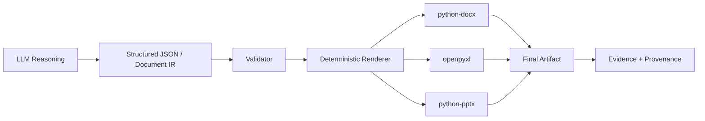

# NovaMindd : SovereignAI

> **A sovereign, local-first AI execution platform for confidential industrial workflows.**

SovereignAI is an AI workbench designed for environments where sensitive documents, internal knowledge, engineering workflows, and AI-generated actions must remain under organisational control.

The core idea is simple:

> **The model provides intelligence. SovereignAI provides authority.**

SovereignAI is not intended to be another local chatbot. It is designed as a **control plane around local AI models**, combining model orchestration, private retrieval, multimodal document understanding, policy-controlled tools, sandboxed execution, validation, deterministic artifact generation, and end-to-end provenance.

---

## Table of Contents

- [Overview](#overview)
- [Problem](#problem)
- [Goals](#goals)
- [Non-Goals](#non-goals)
- [Core Architecture](#core-architecture)
- [How SovereignAI Works](#how-SovereignAI-works)
- [Core Components](#core-components)`
- [Model Orchestration](#model-orchestration)
- [Adaptive Model Residency](#adaptive-model-residency)
- [Knowledge and RAG](#knowledge-and-rag)
- [Multimodal Document Understanding](#multimodal-document-understanding)
- [Agent and Tool Execution](#agent-and-tool-execution)
- [Security Architecture](#security-architecture)
- [Validation and Fail-Closed Behaviour](#validation-and-fail-closed-behaviour)
- [Artifact Generation](#artifact-generation)
- [Audit and Provenance](#audit-and-provenance)
- [End-to-End Workflow](#end-to-end-workflow)
- [Repository Architecture](#repository-architecture)
- [Technology Stack](#technology-stack)
- [Configuration](#configuration)
- [Development Roadmap](#development-roadmap)
- [Evaluation](#evaluation)
- [Security Testing](#security-testing)
- [Deployment Model](#deployment-model)
- [Design Principles](#design-principles)
- [Project Status](#project-status)
- [License](#license)

---

# Overview

SovereignAI provides a controlled environment in which local AI models can:

- understand confidential documents;
- retrieve organisation-specific knowledge;
- reason over text, tables, scans and visual information;
- select an appropriate local model for a task;
- request access to approved tools;
- execute code inside an isolated sandbox;
- generate structured and deterministic artifacts;
- validate generated results;
- preserve evidence and execution provenance.

The platform is deliberately designed so that **LLM output is treated as a proposal, not as an authority**.

```text
                    ┌─────────────────────────┐
                    │      USER / OPERATOR     │
                    └────────────┬────────────┘
                                 │
                                 ▼
                    ┌─────────────────────────┐
                    │     SovereignAI WORKBENCH   │
                    └────────────┬────────────┘
                                 │
                                 ▼
              ┌─────────────────────────────────────┐
              │          SovereignAI CONTROL PLANE      │
              │                                     │
              │  Routing │ Policy │ Tools │ Audit   │
              │  Residency │ Validation │ Provenance│
              └───────────────┬─────────────────────┘
                              │
            ┌─────────────────┼─────────────────┐
            ▼                 ▼                 ▼
       Local Models       Private RAG       Document AI
       LLM / VLM /       BM25 + Vector       OCR + VLM
       Coding Models       + Reranking
            │                 │                 │
            └─────────────────┼─────────────────┘
                              ▼
                    ┌──────────────────────┐
                    │ CONTROLLED EXECUTION │
                    │ Docker + Tool Policy │
                    │ + Egress Enforcement  │
                    └──────────┬───────────┘
                               │
                               ▼
                    ┌──────────────────────┐
                    │ VALIDATION + OUTPUT   │
                    │ Artifacts + Evidence  │
                    │ + Provenance          │
                    └──────────────────────┘
```

---

# Problem

Organisations with confidential operational or engineering data face a different problem from ordinary AI-chat applications.

A useful system must simultaneously handle:

### Confidentiality

Sensitive documents and internal knowledge may not be suitable for transmission to external AI APIs.

### Heterogeneous Data

Useful information may exist in:

- PDFs
- scanned documents
- tables
- engineering drawings
- diagrams
- SOPs
- manuals
- reports
- spreadsheets
- structured records

### Model Constraints

Different tasks require different model capabilities, while local hardware may not have enough VRAM to keep every model loaded simultaneously.

### Agent Safety

An AI model capable of writing code or calling tools must not automatically receive unrestricted access to:

- the host filesystem;
- credentials;
- arbitrary tools;
- the network;
- system resources.

### Reliability

A fluent model response is not necessarily a correct work product.

SovereignAI therefore treats **retrieval, execution, validation and provenance as first-class system components**.

---

# Goals

SovereignAI aims to provide the following capabilities.

## 1. Local AI Inference

Run approved open-weight models locally without requiring external inference APIs for the core workflow.

## 2. Intelligent Model Orchestration

Select models according to task capability and runtime constraints rather than relying only on a manually selected model.

## 3. Private Knowledge Retrieval

Allow organisations to use internal knowledge bases without exporting their underlying documents.

## 4. Multimodal Understanding

Process text, scanned documents, tables and visual technical content through OCR and vision-language models.

## 5. Controlled Agentic Execution

Allow models to request tools while keeping actual execution under platform-level authorization.

## 6. Secure Sandboxing

Execute generated code and approved tools inside isolated environments with resource and filesystem restrictions.

## 7. Network Control

Prevent unrestricted external network access from agent execution environments.

## 8. Validation

Validate model outputs, tool arguments, retrieved evidence and generated artifacts before they are treated as final.

## 9. Provenance

Record what evidence, model, tools and validation steps contributed to an output.

## 10. Deterministic Artifacts

Separate AI reasoning from final document rendering so that DOCX, XLSX, PPTX and similar outputs can be generated reproducibly.

---

# Non-Goals

SovereignAI is **not** intended to be:

- a generic consumer chatbot;
- a replacement for every existing local AI application;
- an unrestricted autonomous computer-use agent;
- a system that assumes Docker alone provides complete security;
- a system that blindly trusts model-generated reasoning;
- a production safety-critical system without deployment-specific validation.

SovereignAI can integrate existing open-source AI components. Its focus is the **control plane that governs how those components are used together**.

---

# Core Architecture

SovereignAI is organised around several logical planes.



---

# How SovereignAI Works

A typical request passes through the following lifecycle:

```text
1. Receive request
        ↓
2. Authenticate user
        ↓
3. Determine required capabilities
        ↓
4. Retrieve relevant internal evidence
        ↓
5. Select suitable local model
        ↓
6. Load / swap required model
        ↓
7. Reason over evidence
        ↓
8. Request tool execution if required
        ↓
9. Apply policy and authorization
        ↓
10. Execute inside sandbox
        ↓
11. Validate result
        ↓
12. Generate deterministic artifact
        ↓
13. Attach evidence and provenance
        ↓
14. Human review / approval when required
```

The model never becomes the sole authority for steps 8–13.

---

# Core Components

## Control Plane

The control plane is the central architectural component.

It is responsible for:

- model selection;
- resource-aware execution;
- tool authorization;
- security policy enforcement;
- validation;
- provenance;
- audit events.

The model may propose an action.

The control plane decides whether that action is permitted.

---

## Model Router

The router maps an incoming task to an appropriate model based on:

- required capability;
- model quality;
- VRAM requirements;
- latency requirements;
- current residency;
- organisational policy.

A conceptual routing pipeline:



The router should remain independently testable from the models themselves.

---

# Adaptive Model Residency

SovereignAI is designed for systems where GPU memory is limited.

Instead of keeping every model in VRAM:

```text
             Local Model Store
              /      |      \
             /       |       \
       General      Vision    Coding
        Model        Model     Model
             \       |       /
              \      |      /
               ▼     ▼     ▼
             Residency Manager
                     │
                     ▼
                  GPU VRAM
                     │
                     ▼
               Active Model
```

The residency manager should support:

- model loading;
- model unloading;
- model swapping;
- memory-aware scheduling;
- active-model tracking;
- bounded context;
- quantized models.

A prototype may target a constrained GPU environment around **6 GB VRAM**, while larger deployments can use more capable departmental GPU systems.

---

# Knowledge and RAG

SovereignAI uses a private knowledge layer to ground model reasoning in organisational information.

The retrieval architecture combines exact and semantic retrieval.



### BM25 / Exact Retrieval

Useful for:

- SOP identifiers;
- document IDs;
- equipment IDs;
- tags;
- exact terminology;
- reference numbers.

### Vector Retrieval

Useful for:

- semantic similarity;
- natural-language questions;
- concept-level retrieval;
- related passages.

### Reranking

A reranker can refine the candidate set before evidence is passed to the model.

The knowledge layer should preserve document metadata and source references so that retrieved evidence can be traced back to its origin.

---

# Multimodal Document Understanding

SovereignAI is intended to work with documents that cannot be reliably reduced to plain text.



The document pipeline can include:

- PDF parsing;
- OCR;
- confidence estimation;
- layout understanding;
- table extraction;
- diagram understanding;
- source-page references;
- VLM escalation.

Low-confidence interpretation should be eligible for additional verification or human review.

---

# Agent and Tool Execution

SovereignAI uses a controlled tool-calling architecture.

The intended relationship is:

```text
LLM
 │
 │ "I want to perform action X"
 ▼
Tool Gateway
 │
 ▼
Policy Engine
 │
 ├── Allowed? ── No ──► Reject + Audit
 │
 └── Yes
       │
       ▼
Tool Authorization
       │
       ▼
Sandbox
       │
       ▼
Execution
       │
       ▼
Result
       │
       ▼
Validation
```

The LLM does not directly receive unrestricted system access.

Tools should have explicit schemas describing:

- name;
- arguments;
- required permissions;
- input types;
- output types;
- resource requirements;
- whether network access is required;
- whether human approval is required.

---

# Security Architecture

Security is implemented as defence in depth.



### Important Security Assumption

Docker is **not** treated as the entire security boundary.

Security should be enforced across multiple layers:

- authentication;
- RBAC;
- policy;
- tool authorization;
- container isolation;
- filesystem restrictions;
- credential isolation;
- network policy;
- resource limits;
- audit logging.

---

# Network Egress

Agent execution environments should follow a **deny-by-default** network policy.

The system should distinguish between:

```text
No Network Access
        │
        ├── Default
        │
        ▼
Explicitly Approved Egress
        │
        ▼
Specific Destination / Protocol / Tool
```

The goal is to prevent generated code from silently:

- sending confidential data externally;
- downloading arbitrary packages;
- calling unknown APIs;
- exfiltrating credentials;
- establishing uncontrolled outbound connections.

---

# Validation and Fail-Closed Behaviour

SovereignAI should prefer a controlled failure over an unsupported confident answer.

Examples:

```text
Weak Evidence
     │
     ▼
Do Not Generate Official Artifact
     │
     ▼
Request More Evidence / Human Review
```

Validation can occur at multiple levels:

### Input Validation

- file type;
- schema;
- size;
- metadata;
- permissions.

### Retrieval Validation

- evidence relevance;
- source availability;
- confidence;
- citation/source mapping.

### Tool Validation

- typed arguments;
- authorization;
- resource limits;
- allowed tool;
- expected output schema.

### Output Validation

- schema;
- required fields;
- evidence linkage;
- consistency;
- artifact correctness.

---

# Artifact Generation

SovereignAI separates AI reasoning from deterministic rendering.



This approach reduces the dependency on the LLM for formatting and makes generated artifacts easier to validate and reproduce.

Supported artifact types can include:

- DOCX;
- XLSX;
- PPTX;
- structured JSON;
- other deterministic formats added through renderer plugins.

---

# Audit and Provenance

Every meaningful execution should be traceable.

A provenance record can capture:

```json
{
  "request_id": "req_...",
  "user": "...",
  "model": "...",
  "model_version": "...",
  "retrieved_sources": [],
  "tools_requested": [],
  "tools_authorized": [],
  "tool_execution": [],
  "validation": {},
  "artifact": {},
  "timestamp": "...",
  "status": "..."
}
```

The exact schema should evolve with implementation.

The important requirement is that an output should be possible to trace back to:

```text
User Request
     ↓
Evidence
     ↓
Model
     ↓
Tool Actions
     ↓
Validation
     ↓
Artifact
```

---

# End-to-End Example

A confidential engineering task could follow this workflow:

```text
User submits an internal inspection report
                    │
                    ▼
             Document ingestion
                    │
                    ▼
             OCR / VLM analysis
                    │
                    ▼
         Relevant internal knowledge
                    │
                    ▼
       Constraint-aware model routing
                    │
                    ▼
          Evidence-grounded reasoning
                    │
                    ▼
          Tool request generated
                    │
                    ▼
             Policy evaluation
                    │
             ┌──────┴──────┐
             │             │
          Denied         Allowed
             │             │
             ▼             ▼
           Audit       Docker sandbox
                           │
                           ▼
                       Tool result
                           │
                           ▼
                        Validation
                           │
                           ▼
                  Structured work product
                           │
                           ▼
                Deterministic DOCX/XLSX
                           │
                           ▼
                   Provenance + Audit
                           │
                           ▼
                    Human review
```

---

# Repository Architecture

The implementation should be organised around clear system boundaries rather than a monolithic application.

A target repository structure:

```text
SovereignAI/
│
├── apps/
│   ├── api/
│   │   ├── routes/
│   │   ├── schemas/
│   │   └── dependencies/
│   │
│   └── web/
│
├── core/
│   ├── control_plane/
│   │   ├── policy/
│   │   ├── authorization/
│   │   ├── routing/
│   │   ├── residency/
│   │   └── validation/
│   │
│   ├── inference/
│   │   ├── providers/
│   │   ├── models/
│   │   └── runtime/
│   │
│   ├── retrieval/
│   │   ├── ingestion/
│   │   ├── bm25/
│   │   ├── vector/
│   │   └── reranking/
│   │
│   ├── document_ai/
│   │   ├── parsers/
│   │   ├── ocr/
│   │   └── vision/
│   │
│   ├── agents/
│   │   ├── planner/
│   │   ├── tools/
│   │   └── execution/
│   │
│   ├── sandbox/
│   │   ├── docker/
│   │   ├── filesystem/
│   │   └── network/
│   │
│   ├── artifacts/
│   │   ├── docx/
│   │   ├── xlsx/
│   │   ├── pptx/
│   │   └── schemas/
│   │
│   └── provenance/
│
├── models/
│   ├── registry/
│   └── manifests/
│
├── policies/
│   ├── tools/
│   ├── network/
│   └── resources/
│
├── knowledge/
│   ├── ingestion/
│   └── indexes/
│
├── sandbox/
│   ├── images/
│   └── profiles/
│
├── tests/
│   ├── unit/
│   ├── integration/
│   ├── security/
│   └── evaluation/
│
├── configs/
│
├── scripts/
│
├── docs/
│
├── docker/
│
├── pyproject.toml
└── README.md
```

This structure is a target architecture; modules can be introduced incrementally during implementation.

---

# Technology Stack

The project is intentionally based on replaceable components.

| Layer | Candidate Technology |
|---|---|
| Frontend | React |
| API | FastAPI |
| Agent Orchestration | LangGraph |
| Local Inference | Ollama / llama.cpp / compatible runtimes |
| Models | Quantized open-weight LLMs, VLMs and coding models |
| Retrieval | BM25 + Vector Search + Reranking |
| Database | PostgreSQL + pgvector |
| Document Processing | PyMuPDF |
| OCR | PaddleOCR or equivalent local OCR |
| Vision | Local VLM |
| Sandbox | Docker |
| Security | RBAC + Policy Engine + Egress Enforcement |
| Artifacts | python-docx, openpyxl, python-pptx |
| Configuration | YAML / environment configuration |
| Testing | pytest + security/evaluation test suites |

Individual components should remain replaceable through interfaces rather than becoming hard dependencies throughout the codebase.

---

# Configuration Model

SovereignAI should avoid hard-coding model, tool and policy decisions into application logic.

Configuration should conceptually define:

```yaml
models:
  - id: general-small
    capabilities:
      - reasoning
      - text
    vram_limit_mb: 4096

  - id: vision-small
    capabilities:
      - vision
      - document_understanding
    vram_limit_mb: 4096

  - id: coding
    capabilities:
      - coding
      - tool_generation
    vram_limit_mb: 8192

policies:
  network:
    default: deny

  filesystem:
    host_mounts: false

  execution:
    non_root: true
```

The actual schema should be defined and versioned as implementation progresses.

---

# Development Roadmap

## Phase 1 — Foundation

- [ ] Repository structure
- [ ] Configuration system
- [ ] Model registry
- [ ] Basic FastAPI service
- [ ] Local model adapter interface
- [ ] Structured logging

## Phase 2 — Local Inference

- [ ] Model provider abstraction
- [ ] Model loading
- [ ] Model unloading
- [ ] Quantized model support
- [ ] Model capability metadata
- [ ] Basic router

## Phase 3 — Knowledge Layer

- [ ] Document ingestion
- [ ] PDF processing
- [ ] OCR
- [ ] Chunking
- [ ] BM25 index
- [ ] Vector index
- [ ] Reranking
- [ ] Source metadata

## Phase 4 — Control Plane

- [ ] Policy engine
- [ ] RBAC
- [ ] Tool registry
- [ ] Tool authorization
- [ ] Resource policies
- [ ] Model residency manager

## Phase 5 — Secure Execution

- [ ] Docker sandbox
- [ ] Non-root execution
- [ ] Restricted filesystem
- [ ] Resource limits
- [ ] Credential isolation
- [ ] Egress policy
- [ ] Security event logging

## Phase 6 — Agentic Workflows

- [ ] Planner
- [ ] Typed tools
- [ ] Structured tool calls
- [ ] Tool result validation
- [ ] Fail-closed behaviour
- [ ] Human approval checkpoints

## Phase 7 — Artifacts

- [ ] Structured document IR
- [ ] DOCX renderer
- [ ] XLSX renderer
- [ ] PPTX renderer
- [ ] Artifact validation
- [ ] Provenance attachment

## Phase 8 — Evaluation

- [ ] Routing benchmarks
- [ ] VRAM measurements
- [ ] Latency measurements
- [ ] Model swap measurements
- [ ] Retrieval evaluation
- [ ] Security tests
- [ ] Artifact correctness tests
- [ ] End-to-end provenance tests

---

# Evaluation

SovereignAI should be evaluated as a **system**, not only by measuring LLM response quality.

## Model Orchestration

Measure:

- task success;
- peak VRAM;
- P95 latency;
- model load time;
- model swap time;
- OOM failures.

## Retrieval

Measure:

- retrieval recall;
- exact identifier retrieval;
- semantic retrieval;
- reranking effectiveness;
- evidence grounding.

## Document Understanding

Measure:

- OCR accuracy;
- OCR confidence;
- table extraction;
- visual/diagram understanding;
- source-page attribution.

## Secure Execution

Test whether the system blocks and records:

- unauthorised file access;
- unauthorised tool use;
- host filesystem access;
- credential access;
- external HTTP requests;
- prohibited network destinations.

## Artifact Generation

Measure:

- schema validity;
- evidence linkage;
- deterministic rendering;
- artifact correctness;
- reproducibility.

## End-to-End

Track:

```text
Request
  → Evidence
  → Model
  → Tool Actions
  → Validation
  → Artifact
  → Provenance
```

No performance numbers should be presented as established until they have been measured under a defined test configuration.

---

# Security Testing

Security testing is a first-class part of the project.

The test suite should include adversarial attempts such as:

```text
Agent
 │
 ├── Read /etc/passwd
 ├── Read host-mounted files
 ├── Access environment secrets
 ├── Access credentials
 ├── Open arbitrary HTTP connection
 ├── Download an unapproved package
 ├── Escape sandbox
 └── Invoke an unauthorised tool
```

Expected behaviour:

```text
Attempt
  ↓
Policy / Sandbox
  ↓
BLOCK
  ↓
Audit Event
```

Tests should verify both:

1. **The action was prevented.**
2. **The prevention was recorded.**

---

# Deployment Model

SovereignAI is designed for progressive deployment.

```text
                    ┌────────────────────┐
                    │    Development     │
                    │ Local workstation  │
                    └─────────┬──────────┘
                              │
                              ▼
                    ┌────────────────────┐
                    │     Prototype      │
                    │   ~6 GB GPU        │
                    └─────────┬──────────┘
                              │
                              ▼
                    ┌────────────────────┐
                    │    Departmental    │
                    │   16–24 GB+ GPU    │
                    └─────────┬──────────┘
                              │
                              ▼
                    ┌────────────────────┐
                    │ Organisation-wide  │
                    │ Multi-GPU / Server │
                    └────────────────────┘
```

The core architecture should remain consistent while capacity and concurrency increase.

---

# Offline / Air-Gapped Operation

Core functionality should be deployable without continuous internet connectivity.

A deployment can pre-stage:

- approved model weights;
- inference runtimes;
- Python packages;
- container images;
- OCR models;
- VLM models;
- internal knowledge indexes;
- artifact-generation dependencies.

The system should not depend on downloading arbitrary resources during a sensitive execution.

---

# Design Principles

## 1. Intelligence Is Not Authority

The model proposes. The platform authorizes.

## 2. Local Does Not Automatically Mean Secure

Data residency is only one part of security.

## 3. Least Privilege by Default

Tools, files, credentials and network access should be explicitly authorized.

## 4. Fail Closed

Insufficient evidence or failed validation should stop or escalate a workflow rather than silently produce an official result.

## 5. Evidence Before Confidence

The system should prefer traceable evidence over fluent unsupported output.

## 6. Deterministic Where Possible

LLMs should handle reasoning; deterministic software should handle validation and artifact rendering wherever practical.

## 7. Model Agnostic

The platform should not be architecturally coupled to a single model vendor or model family.

## 8. Everything Important Is Observable

Routing, execution, validation and provenance should be measurable and auditable.

---

# Project Status

SovereignAI is being developed as an engineering project / prototype.

The repository is intended to evolve toward a working platform rather than remain a conceptual demonstration.

The implementation priority is:

```text
Control Plane
      ↓
Local Inference
      ↓
Private Knowledge
      ↓
Secure Execution
      ↓
Validation
      ↓
Artifacts
      ↓
Provenance
      ↓
Evaluation
```

Features should be considered complete only after they have corresponding tests.

---

# Contributing

Contributions should preserve SovereignAI's architectural boundaries.

In particular:

- models should not directly control privileged resources;
- tools should expose typed interfaces;
- security policies should remain explicit;
- execution should remain sandboxable;
- new model providers should implement the common inference interface;
- new artifacts should use structured intermediate representations;
- important actions should produce audit events;
- security-sensitive behaviour should have automated tests.

---

# License

License to be defined.

---

## Final Principle

SovereignAI is built around one architectural distinction:

```text
                 AI MODEL
              "What should I do?"
                     │
                     ▼
              SovereignAI CONTROL
              "Are you allowed?"
                     │
                     ▼
              EXECUTION LAYER
              "What actually ran?"
                     │
                     ▼
               VALIDATION
              "Did it work?"
                     │
                     ▼
               PROVENANCE
              "Can we prove it?"
```

**The model reasons.  
SovereignAI controls.  
The system verifies.  
The human remains accountable.**
